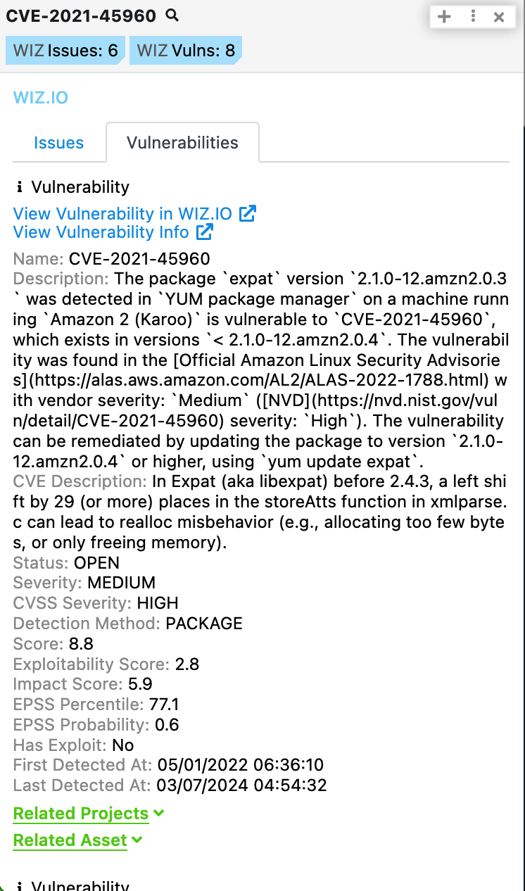
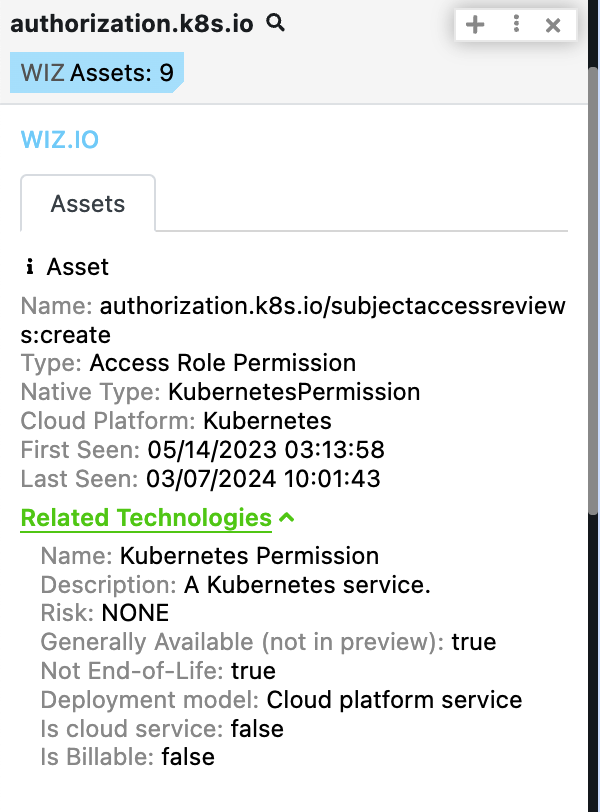
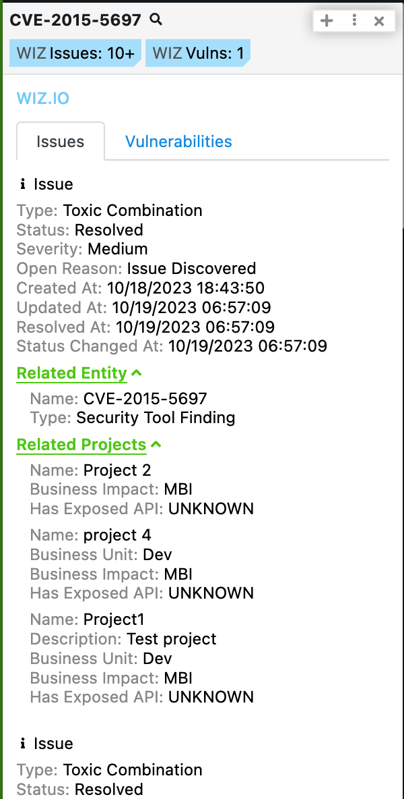

# Polarity Wiz Integration

Wiz helps organizations create secure cloud environments by creating a normalizing layer between cloud environments, enabling them to rapidly identify and remove critical risks.

The Polarity Wiz integration allows Polarity to search Wiz for Issues and Vulnerabilities by CVEs and Assets by IP Addresses, Domains, and CVEs.

To learn more about Wiz, visit the [official website](https://www.wiz.io/about).

  
  

  

## Wiz Integration Options
### Client ID
Your Wiz Client ID. Obtain yours here: https://partners.wiz.io/prm/english/c/Integration-API-Signup

### Client Secret
Your Wiz Client Secret. Obtain yours here: https://partners.wiz.io/prm/english/c/Integration-API-Signup

## Installation Instructions
Installation instructions for integrations are provided on the [PolarityIO GitHub Page](https://polarityio.github.io/).

## Polarity
Polarity is a memory-augmentation platform that improves and accelerates analyst decision making. For more information about the Polarity platform please see:

https://polarity.io/
